# Modelo de Casos de Uso - Sistema La Esperanza

Diagrama de actores y casos de uso del sistema.

Notas:
- UC15 (Registrar acuerdo comercial) y UC16 (Programar entrega) se ejecutan en un único paso dentro del prototipo: al aceptar la solicitud se capturan `precio_final`, `fecha_programada` y `punto_entrega`.
- UC18 (Marcar entrega realizada) y UC8 (Confirmar recepción) cierran el acuerdo: la confirmación del comprador establece `estado_final = confirmada`; de lo contrario, el admin puede dejarlo en `incumplida`.
- Cada transición del acuerdo pasa por UC17 (Actualizar seguimiento), que captura comentario, usuario y fecha_hora en la bitácora.

```mermaid
flowchart LR
    Invitado[Invitado]
    Comprador[Comprador]
    Productor[Productor]
    Admin[Asociación / Administrador]

    subgraph Sistema["Sistema La Esperanza - Gestión Agrícola"]
        UC1((Iniciar sesión))
        UC2((Consultar catálogo de productos))
        UC3((Ver detalle de producto))
        UC4((Realizar solicitud de compra))
        UC5((Enviar mensaje / negociar acuerdo))
        UC6((Consultar mis compras))
        UC7((Consultar seguimiento de entrega))
        UC8((Confirmar recepción))
        UC9((Solicitar cancelación))
        UC10((Reportar inconformidad))

        UC11((Gestionar mis productos))
        UC12((Editar producto: cantidad / precio ref.))
        UC13((Consultar solicitudes recibidas))
        UC14((Aceptar o rechazar solicitud))
        UC15((Registrar acuerdo comercial))
        UC16((Programar entrega))
        UC17((Actualizar seguimiento))
        UC18((Marcar entrega realizada))
        UC19((Justificar incumplimiento))
        UC20((Consultar historial de ventas))

        UC21((Gestionar usuarios))
        UC22((Crear usuario))
        UC23((Editar usuario))
        UC24((Reiniciar PIN de usuario))
        UC25((Suspender / bloquear cuenta))
        UC26((Resolver incidencias))
        UC27((Forzar cancelación))
        UC28((Ver estadísticas generales))
        UC29((Supervisar productos, acuerdos y entregas))
        UC30((Gestionar categorías de producto))
        UC31((Gestionar unidades de medida))
        UC34((Gestionar puntos de entrega))

        UC32((Gestionar mi perfil))
        UC33((Cambiar PIN))
    end

    Invitado --> UC2
    Invitado --> UC3

    Comprador --> UC1
    Comprador --> UC2
    Comprador --> UC3
    Comprador --> UC4
    Comprador --> UC5
    Comprador --> UC6
    Comprador --> UC7
    Comprador --> UC8
    Comprador --> UC9
    Comprador --> UC10
    Comprador --> UC32
    Comprador --> UC33

    Productor --> UC1
    Productor --> UC5
    Productor --> UC11
    Productor --> UC12
    Productor --> UC13
    Productor --> UC14
    Productor --> UC15
    Productor --> UC16
    Productor --> UC17
    Productor --> UC18
    Productor --> UC19
    Productor --> UC20
    Productor --> UC32
    Productor --> UC33

    Admin --> UC1
    Admin --> UC21
    Admin --> UC22
    Admin --> UC23
    Admin --> UC24
    Admin --> UC25
    Admin --> UC26
    Admin --> UC27
    Admin --> UC28
    Admin --> UC29
    Admin --> UC30
    Admin --> UC31
    Admin --> UC34
    Admin --> UC32
    Admin --> UC33

    UC4 -. incluye .-> UC5
    UC14 -. incluye .-> UC15
    UC15 -. incluye .-> UC16
    UC16 -. usa .-> UC34
    UC15 -. genera .-> UC17
    UC14 -. genera .-> UC17
    UC18 -. genera .-> UC17
    UC8 -. genera .-> UC17
    UC9 -. extiende .-> UC26
    UC10 -. extiende .-> UC26
    UC19 -. extiende .-> UC26
    UC21 -. incluye .-> UC22
    UC21 -. incluye .-> UC23
    UC21 -. incluye .-> UC24
    UC21 -. incluye .-> UC25
    UC11 -. usa .-> UC30
    UC11 -. usa .-> UC31
```

## Cambios respecto a la versión anterior

1. **UC12 reformulado**: antes era genérico "Actualizar cantidades y precio referencial"; ahora es "Editar producto" con alcance explícito (nombre, categoría, descripción, unidad, cantidad y precio referencial). El prototipo expone este caso en `/products/:id/edit`.
2. **UC15 + UC16 como paso único al aceptar**: el prototipo integra el registro del acuerdo (precio_final, fecha_programada) y la programación de entrega (punto_entrega del catálogo) en el mismo flujo de aceptación. Se conservan como casos de uso separados por claridad del análisis.
3. **UC17 incluye comentario + usuario + fecha_hora**: toda transición de estado del acuerdo genera una entrada en la bitácora de seguimiento. Se añadieron flechas `genera` desde UC14, UC15, UC18 y UC8.
4. **UC34 nuevo**: "Gestionar puntos de entrega" como caso de uso explícito del administrador (antes el punto de entrega era un campo libre).
5. **Estados intermedios formalizados**: el ciclo del acuerdo incluye `preparando` y `en_ruta` además de los estados originales (documentado en el modelo ER, sección "Dominios de valores").
