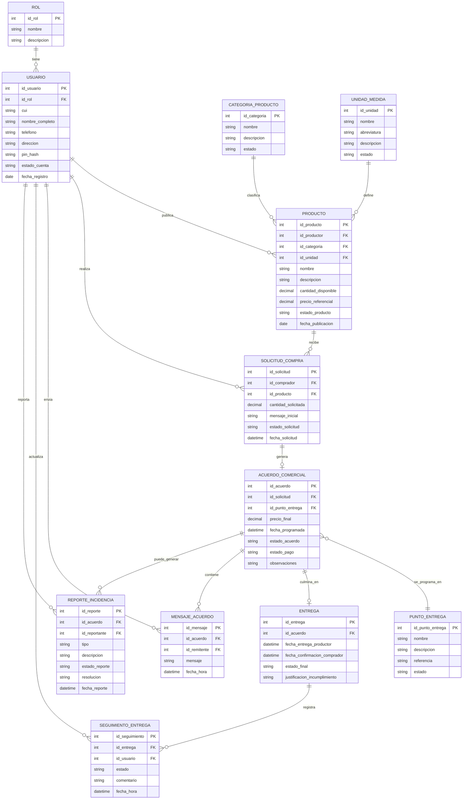

# Modelo Entidad-Relación (ER) - Sistema La Esperanza

Diagrama ER para las entidades principales del sistema.

```mermaid
erDiagram
    ROL ||--o{ USUARIO : tiene
    USUARIO ||--o{ PRODUCTO : publica
    CATEGORIA_PRODUCTO ||--o{ PRODUCTO : clasifica
    UNIDAD_MEDIDA ||--o{ PRODUCTO : define
    USUARIO ||--o{ SOLICITUD_COMPRA : realiza
    PRODUCTO ||--o{ SOLICITUD_COMPRA : recibe
    SOLICITUD_COMPRA ||--o| ACUERDO_COMERCIAL : genera
    ACUERDO_COMERCIAL }o--|| PUNTO_ENTREGA : se_programa_en
    ACUERDO_COMERCIAL ||--o| ENTREGA : culmina_en
    ENTREGA ||--o{ SEGUIMIENTO_ENTREGA : registra
    ACUERDO_COMERCIAL ||--o{ MENSAJE_ACUERDO : contiene
    ACUERDO_COMERCIAL ||--o{ REPORTE_INCIDENCIA : puede_generar
    USUARIO ||--o{ MENSAJE_ACUERDO : envia
    USUARIO ||--o{ SEGUIMIENTO_ENTREGA : actualiza
    USUARIO ||--o{ REPORTE_INCIDENCIA : reporta

    ROL {
        int id_rol PK
        string nombre
        string descripcion
    }

    USUARIO {
        int id_usuario PK
        int id_rol FK
        string cui
        string nombre_completo
        string telefono
        string direccion
        string pin_hash
        string estado_cuenta
        date fecha_registro
    }

    CATEGORIA_PRODUCTO {
        int id_categoria PK
        string nombre
        string descripcion
        string estado
    }

    UNIDAD_MEDIDA {
        int id_unidad PK
        string nombre
        string abreviatura
        string descripcion
        string estado
    }

    PRODUCTO {
        int id_producto PK
        int id_productor FK
        int id_categoria FK
        int id_unidad FK
        string nombre
        string descripcion
        decimal cantidad_disponible
        decimal precio_referencial
        string estado_producto
        date fecha_publicacion
    }

    SOLICITUD_COMPRA {
        int id_solicitud PK
        int id_comprador FK
        int id_producto FK
        decimal cantidad_solicitada
        string mensaje_inicial
        string estado_solicitud
        datetime fecha_solicitud
    }

    ACUERDO_COMERCIAL {
        int id_acuerdo PK
        int id_solicitud FK
        int id_punto_entrega FK
        decimal precio_final
        datetime fecha_programada
        string estado_acuerdo
        string estado_pago
        string observaciones
    }

    PUNTO_ENTREGA {
        int id_punto_entrega PK
        string nombre
        string descripcion
        string referencia
        string estado
    }

    ENTREGA {
        int id_entrega PK
        int id_acuerdo FK
        datetime fecha_entrega_productor
        datetime fecha_confirmacion_comprador
        string estado_final
        string justificacion_incumplimiento
    }

    SEGUIMIENTO_ENTREGA {
        int id_seguimiento PK
        int id_entrega FK
        int id_usuario FK
        string estado
        string comentario
        datetime fecha_hora
    }

    MENSAJE_ACUERDO {
        int id_mensaje PK
        int id_acuerdo FK
        int id_remitente FK
        string mensaje
        datetime fecha_hora
    }

    REPORTE_INCIDENCIA {
        int id_reporte PK
        int id_acuerdo FK
        int id_reportante FK
        string tipo
        string descripcion
        string estado_reporte
        string resolucion
        datetime fecha_reporte
    }
```
