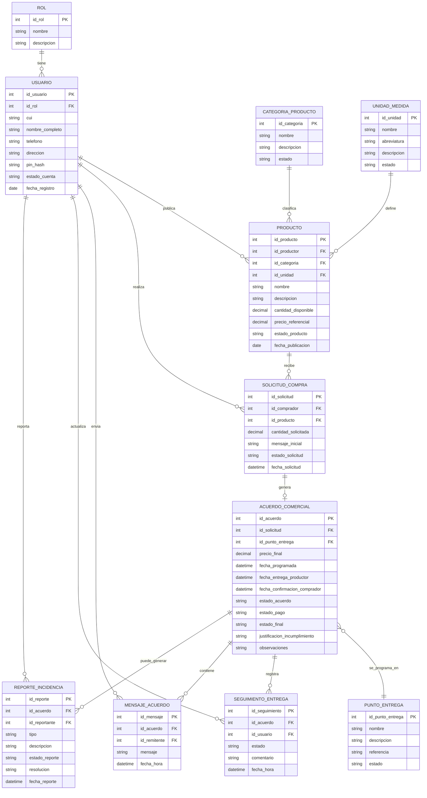

# Modelo Entidad-Relación (ER) - Sistema La Esperanza

Diagrama ER para las entidades principales del sistema.

Notas de modelado:
- **ACUERDO_COMERCIAL** concentra tanto la formalización del acuerdo como los datos de la entrega (fechas, estado final, justificación). En el prototipo se mostraron como una sola entidad por simplicidad operativa; aquí se mantiene esa unificación para evitar una tabla `ENTREGA` con una relación 1:1 pobre.
- **SEGUIMIENTO_ENTREGA** registra cada transición del acuerdo con `estado`, `comentario`, `usuario` y `fecha_hora`. Es la bitácora auditable que alimenta el stepper visual.
- **PUNTO_ENTREGA** es un catálogo maestro administrado por la Asociación.
- **CATEGORIA_PRODUCTO** y **UNIDAD_MEDIDA** también son catálogos maestros.

## Dominios de valores

### `ACUERDO_COMERCIAL.estado_acuerdo`
Ciclo de vida del acuerdo, reflejado en el stepper del prototipo:

- `solicitado` — solicitud creada por el comprador, a la espera de respuesta.
- `aceptado` — productor aceptó y se registraron precio_final, fecha_programada y punto_entrega.
- `preparando` — productor está alistando la cosecha.
- `programado` — entrega confirmada en agenda.
- `en_ruta` — productor inició traslado.
- `entregado_productor` — productor marcó la entrega.
- `confirmado_comprador` — comprador confirmó recepción (estado terminal feliz).
- `cancelado` — acuerdo cancelado por cualquiera de las partes o por el administrador.

### `ACUERDO_COMERCIAL.estado_pago`
- `pendiente`
- `contra_entrega`
- `realizado`

### `ACUERDO_COMERCIAL.estado_final`
Se establece al cerrar el acuerdo:
- `confirmada` — entrega aceptada.
- `incumplida` — no se entregó o hubo reporte de inconformidad aceptado.
- `cancelada` — acuerdo cancelado antes de entrega.

### `REPORTE_INCIDENCIA.tipo`
- `inconformidad_cantidad`
- `inconformidad_calidad`
- `incumplimiento_entrega`
- `otro`

### `REPORTE_INCIDENCIA.estado_reporte`
- `abierto`
- `en_revision`
- `resuelto`
- `descartado`
